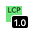

# Large Contentful Paint (LCP) Chrome Extension



This Chrome extension tracks the [LCP (Large Contentful Paint)](https://web.dev/lcp/ "web.dev article on LCP") metric for pages that you visit as you browse the Web.

## Installation

This is very alpha! I haven't put the extension in the store yet, so, clone the repo and then go to chrome://extensions. Once there, click on the "Load unpacked" button and select the directory that you just cloned.

## Features

- As LCP events are sent to the extension from the [PerformanceObserver](https://developer.mozilla.org/en-US/docs/Web/API/PerformanceObserver) the icon will update by changing color (green for good, yellow for adequate, and red for pood) and showing the number of seconds in the badge. If it takes longer than 9999 seconds, it will just say "BAD" because the badge can only show 4 characters and .... well it *is* really bad
- Click on the icon UI to turn the extension on or off (it will show a red square if off, and a green one if there isn't an existing LCP score for on)
- It stores the LCP for the load in local storage, so when you go back it can show you the score from earlier

## Bugs

- It doesn't handle multiple windows well, so the icon UI may be showing the run from the last tab in the window

# TODO

- [x] Set the default icon to be the "on" one
- [x] When LCP arrives, console out the result
- [x] When LCP arrives, set the badge to the number of seconds
- [x] When LCP arrives, set the icon that matches the color that maps to the result (green, yellow, red)
- [x] When LCP arrives, set the badge color that maps to the result (green, yellow, red)
- [x] The icon is a toggle for the extension (when on, attach the content script, else don't)
- [x] When you toggle the extension back on, try to load up an old score if one is there
- [x] When LCP arrives, if it is more than 9999, then set to "BAD"
- [x] Create the icons for each size (including 128x)
- [ ] Cool to use tab ID vs. URL?
- [ ] If you are using multiple windows, when you change the window the icon gets out of sync
- [ ] Publish the extension!

# Metrics

Color  | Description
------ | -------------
GREEN  | good
YELLOW | adequate
RED    | poor

## LCP thresholds

Color  | Threshold
------ | -------------
GREEN  | < 2.5 seconds
YELLOW | < 4s
RED    | 4s

## Other metrics as FYI:

```
FCP: GREEN < 1 second,         YELLOW < 3s,    RED > 4s
FID: GREEN < 100 milliseconds, YELLOW < 300ms, RED > 300ms
CLS: GREEN < 0.1,              YELLOW < 0.25,  RED > 0.25
```

# States

- Extension is on, but no results for this tab: "LCP" with a [green] square
- Extension is off, but no results for this tab: "LCP" with a [red] square
- LCP is good: Green background with score in badge
- LCP is adequate: Yellow background with score in badge
- LCP is poor: Red background with score in badge, or "BAD" if the score is greater than 9999 due to a badge only allowing 4 characters
